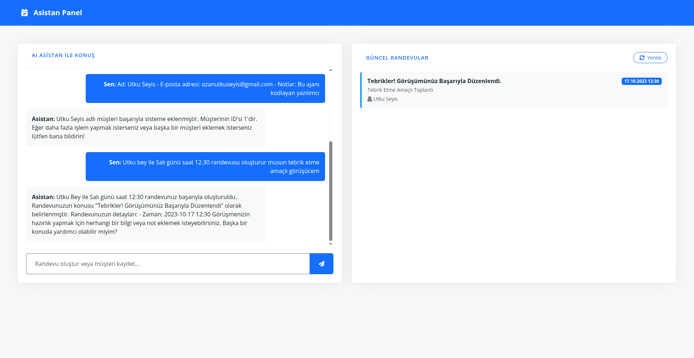

# Akıllı AI Asistan & Takvim Yönetim Sistemi

Bu proje ile müşterileri kayıtlarınızı yönetebilir, randevu takviminizi takip edebilir, randevu oluşturunca otomatik olarak müşterilerizi bilgilendirebilirsiniz.

##  Özellikler

- **Gelişmiş AI Asistanı:** Müşteri ekleme ve randevu planlama süreçlerini doğal dil işleme ile yönetir.
- **Akıllı E-posta:** `.env` üzerinden `SEND_EMAIL` kontrolü aktifse randevu anında müşteriye otomatik SMTP maili gönderir. Eğer mail adresi eksikse agent kullanıcıyı bilgilendirmesi için uyarır.
- **Canlı Takvim Paneli:** Ajandan bağımsız olarak veri tabanındaki tüm randevuları anlık listeleyen dinamik arayüz.



## 🛠️ Kurulum ve Çalıştırma

### 1. Gereksinimler
- Python 3.14+
- Ollama (modeli kendiniz belirleyebilirsiniz ben `qwen2.5:7b` kullandım)
- PostgreSQL veya SQLite veri tabanı
- Pip

### 2. Bağımlılıkların Kurulması
Sanal ortamınızı oluşturun
```bash
python3 -m venv .venv
```
Linux/Macos
```bash
source .venv/bin/activate
```
Windows
```bash
.venv\Scripts\activate.bat
```
Bağımlılıkları yükleyin
```bash
pip install -r requirements.txt
```

### 3. .env yapılandırılması
[exampleenv.txt](exampleenv.txt) dosyasını örnek kullanarak bir `.env` dosyası oluşturun
### 4. Projeyi Başlatma
```bash
uvicorn main:app --reload
```

## 📝 Yapılacaklar (Todo)

- **Eski Sohbetleri Açma ve Devam Etme:** Backend altyapısı tamamlandı, arayüz (front-end) entegrasyonu ve görsel düzenlemeleri yapılacak.
- **Multi-Tenant (Çok kullanıcı) Yapısı:** (Belki/Elbet bir gün) mimariyi birden fazla kurumsal hesaba/şirkete hizmet verecek şekilde genişletme.